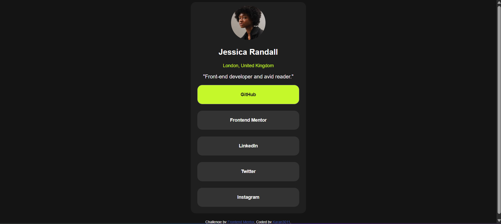
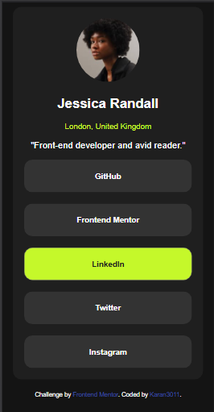

# Frontend Mentor - Social links profile solution

This is a solution to the [Social links profile challenge on Frontend Mentor](https://www.frontendmentor.io/challenges/social-links-profile-UG32l9m6dQ). Frontend Mentor challenges help you improve your coding skills by building realistic projects. 

## Table of contents

- [Overview](#overview)
  - [The challenge](#the-challenge)
  - [Screenshot](#screenshot)
  - [Links](#links)
- [My process](#my-process)
  - [Built with](#built-with)
  - [What I learned](#what-i-learned)
  - [Continued development](#continued-development)
- [Author](#author)

**Note: Delete this note and update the table of contents based on what sections you keep.**

## Overview

### The challenge

Users should be able to:

- See hover and focus states for all interactive elements on the page

### Screenshot

Desktop:

Mobile: 

### Links

- Solution URL: [Social links](https://karannn3011.github.io/social-links-frontendmentor/)

## My process

### Built with

- Semantic HTML5 markup
- CSS custom properties
- Flexbox

### What I learned

To add interactive elements to webpage using CSS transitions.

### Continued development

I will continue focusing on viewport optimization to make sure that website is equally responsive irrespective of device.

## Author

- Frontend Mentor - [@Karan30011](https://www.frontendmentor.io/profile/Karannn3011)
